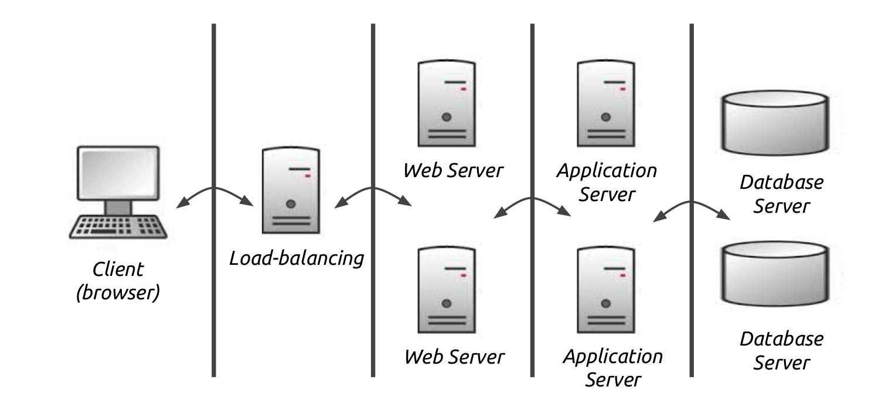
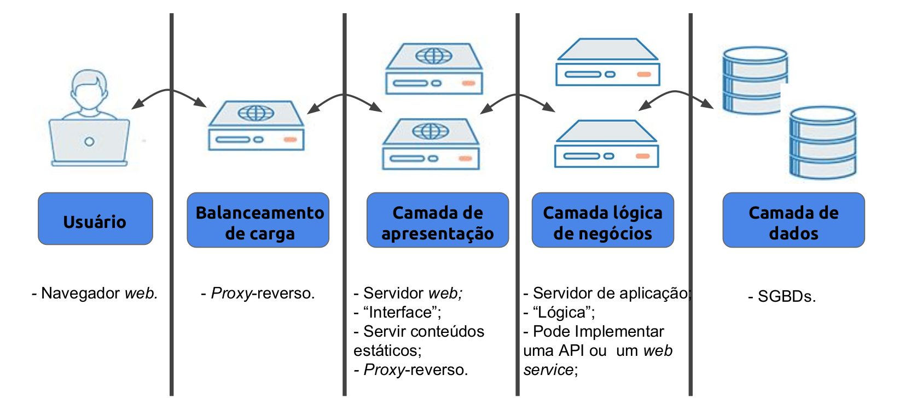
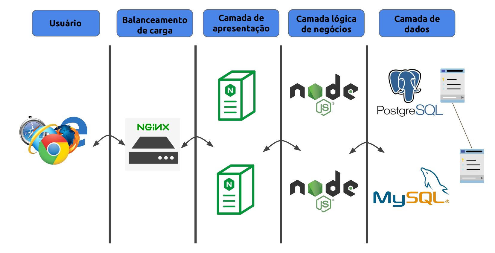
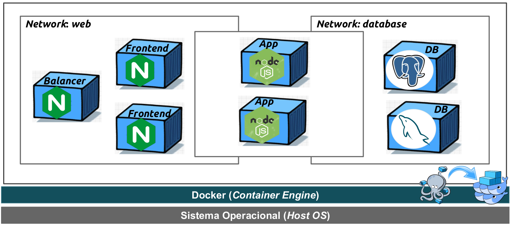

# clustering

## Arquitetura conceitual

Aplicação para uma arquitetura clusterizada com servidores web, servidores de aplicação e bancos de dados.

# Decisões de projeto

<ul>
<li>Servidores web: Nginx;</li>
<li>Servidores de aplicação: Papel realizado por uma API RESTful implementada em
JavaScript sob o ambiente provido pelo Node.js;</li>
<li>Implementações distintas de banco de dados: PostgreSQL e MySQL;
<li>Tabelas distribuídas entre os SGBDs;</li>
<li>Balanceamento de carga com um Servidor Nginx adicional.</li>
</ul>

